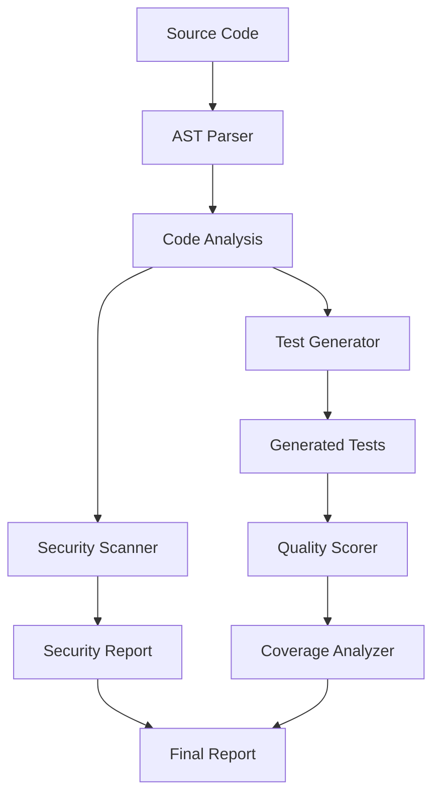

# TestGen Copilot Assistant - Architecture Documentation

## System Overview

TestGen Copilot Assistant is a CLI tool and VS Code extension that leverages Large Language Models (LLMs) to automatically generate comprehensive unit tests and identify security vulnerabilities in codebases.

## Architecture Principles

- **Modularity**: Clear separation of concerns with dedicated modules for parsing, generation, security, and coverage
- **Extensibility**: Plugin-based architecture for supporting multiple languages and testing frameworks
- **Performance**: Efficient AST parsing and caching mechanisms for large codebases
- **Security**: Built-in security scanning with configurable rules and threat detection
- **Quality**: Comprehensive test quality scoring and coverage analysis

## System Components

### 1. Core Components

```
src/testgen_copilot/
├── core.py              # Main engine and orchestration
├── cli.py               # Command-line interface
├── generator.py         # Test generation logic
├── ast_utils.py         # Abstract Syntax Tree parsing
├── security.py          # Security vulnerability detection
├── coverage.py          # Coverage analysis and reporting
└── quality.py           # Test quality assessment
```

### 2. Supporting Components

```
src/testgen_copilot/
├── file_utils.py        # File system operations
├── cache.py             # Caching layer for performance
├── logging_config.py    # Structured logging configuration
├── profiler.py          # Performance profiling
├── progress.py          # Progress tracking and reporting
├── streaming.py         # Real-time output streaming
├── resource_limits.py   # Resource management and limits
├── security_rules.py    # Security rule definitions
└── vscode.py            # VS Code extension integration
```

## Data Flow



## Component Interactions

### 1. Test Generation Pipeline

1. **Input Processing**: CLI accepts source files and configuration
2. **AST Parsing**: `ast_utils.py` parses source code into abstract syntax trees
3. **Code Analysis**: `core.py` analyzes functions, classes, and methods
4. **Test Generation**: `generator.py` creates comprehensive test cases
5. **Quality Assessment**: `quality.py` scores test effectiveness
6. **Output**: Generated tests written to specified directory

### 2. Security Analysis Pipeline

1. **Security Scanning**: `security.py` applies configurable security rules
2. **Vulnerability Detection**: Pattern matching against known vulnerabilities
3. **Risk Assessment**: Severity scoring and categorization
4. **Reporting**: Structured security reports with recommendations

### 3. Coverage Analysis Pipeline

1. **Existing Test Discovery**: Locate and analyze existing test files
2. **Coverage Mapping**: Map test coverage to source code
3. **Gap Analysis**: Identify uncovered functions and branches
4. **Reporting**: Coverage percentages and missing coverage details

## Integration Points

### VS Code Extension
- Language Server Protocol (LSP) integration
- Real-time diagnostics and suggestions
- Command palette integration
- Side panel for test preview and management

### CI/CD Integration
- GitHub Actions workflow integration
- Coverage reporting to external services
- Security scan results in CI pipelines
- Automated test generation on code changes

### External Services
- Coverage reporting (Codecov, Coveralls)
- Security scanning (Snyk, GitHub Security)
- Code quality platforms (SonarQube, CodeClimate)

## Configuration Architecture

### Configuration Hierarchy
1. Command-line arguments (highest priority)
2. Project-specific `.testgen.config.json`
3. User-specific configuration
4. Default values (lowest priority)

### Configuration Schema
```json
{
  "language": "python|javascript|typescript|java|csharp|go|rust",
  "test_framework": "framework-specific",
  "coverage_target": 0-100,
  "quality_target": 0-100,
  "security_rules": {...},
  "test_patterns": {...},
  "output": {...}
}
```

## Security Considerations

### Input Validation
- Strict file path validation
- Code injection prevention
- Resource limit enforcement

### Secure Defaults
- Safe file operations
- Sandboxed execution environment
- Minimal privilege requirements

### Audit Trail
- Comprehensive logging
- Operation tracking
- Security event monitoring

## Performance Characteristics

### Scalability
- Parallel processing for large codebases
- Incremental analysis for changed files
- Caching for repeated operations

### Resource Management
- Memory usage monitoring
- CPU time limits
- Disk space management

### Optimization Strategies
- AST caching for unchanged files
- Incremental test generation
- Batch processing for efficiency

## Deployment Architecture

### CLI Distribution
- PyPI package distribution
- Standalone executable builds
- Container-based deployment

### VS Code Extension
- VS Code Marketplace distribution
- Auto-update mechanism
- Cross-platform compatibility

## Monitoring and Observability

### Metrics Collection
- Performance metrics
- Usage statistics
- Error rates and patterns

### Logging Strategy
- Structured JSON logging
- Configurable log levels
- Integration with log aggregation systems

### Health Checks
- System health monitoring
- Dependency availability checks
- Performance threshold alerts

## Future Architecture Considerations

### Extensibility
- Plugin architecture for new languages
- Custom security rule definitions
- Extensible output formats

### Cloud Integration
- Cloud-based LLM services
- Distributed processing capabilities
- Collaborative features

### AI/ML Enhancements
- Machine learning for test quality improvement
- Predictive vulnerability detection
- Adaptive test generation strategies