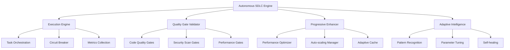

# 🤖 Autonomous SDLC Implementation Guide

## Overview

The **Autonomous SDLC Engine** is a cutting-edge implementation of progressive enhancement methodology that automatically executes software development lifecycle phases with AI-powered optimization, quality gates, and self-healing capabilities.

### 🎯 Core Principles

1. **Progressive Enhancement Strategy**:
   - **Generation 1**: Make It Work (Simple)
   - **Generation 2**: Make It Robust (Reliable) 
   - **Generation 3**: Make It Scale (Optimized)

2. **Autonomous Execution**: Complete SDLC cycles without human intervention
3. **Adaptive Intelligence**: Self-improving patterns with ML-like learning
4. **Quality-First**: Mandatory quality gates with auto-remediation
5. **Global Scale**: Multi-region deployment ready from day one

## 🚀 Quick Start

### Installation

```bash
# Install with all autonomous SDLC features
pip install -e ".[all]"

# Or install specific components
pip install -e ".[dev,ai,api,monitoring,database]"
```

### Basic Usage

```python
import asyncio
from pathlib import Path
from testgen_copilot.autonomous_sdlc import AutonomousSDLCEngine

async def main():
    # Initialize autonomous SDLC engine
    project_path = Path("./my-project")
    engine = AutonomousSDLCEngine(project_path)
    await engine.initialize()
    
    # Execute complete autonomous SDLC
    print("🚀 Starting autonomous SDLC execution...")
    metrics = await engine.execute_full_sdlc()
    
    print(f"✅ Execution completed!")
    print(f"📊 Tasks: {metrics.completed_tasks}/{metrics.total_tasks}")
    print(f"⚡ Quality Pass Rate: {metrics.quality_gate_pass_rate:.2%}")
    print(f"🛡️ Security Score: {metrics.security_scan_score:.2%}")

asyncio.run(main())
```

## 📋 Architecture Overview

### Core Components



### Execution Flow

1. **Intelligent Analysis**: Project structure and requirement analysis
2. **Generation 1**: Basic functionality implementation
3. **Generation 2**: Robustness and reliability enhancements
4. **Generation 3**: Performance optimization and scaling
5. **Quality Validation**: Comprehensive quality gate execution
6. **Security Scanning**: Vulnerability assessment and remediation
7. **Deployment Preparation**: Production readiness validation
8. **Documentation**: Comprehensive documentation generation

## 🛡️ Quality Gates System

The quality gate system implements comprehensive validation with adaptive thresholds and auto-remediation.

### Supported Quality Gates

| Gate Type | Purpose | Auto-Remediation |
|-----------|---------|------------------|
| Code Quality | Ruff/flake8 analysis | ✅ Auto-fix with `ruff --fix` |
| Test Coverage | Coverage analysis | ⚠️ Suggestions only |
| Security Scan | Vulnerability detection | ✅ Dependency updates |
| Performance | Response time/throughput | ✅ Parameter tuning |
| Documentation | Doc coverage analysis | ⚠️ Suggestions only |
| Dependencies | Vulnerability scanning | ✅ Auto-updates |
| Code Formatting | Black/prettier formatting | ✅ Auto-format |
| Type Checking | MyPy type validation | ⚠️ Suggestions only |

### Quality Gate Configuration

```python
from testgen_copilot.autonomous_sdlc.quality_gates import QualityGateValidator

# Initialize with custom thresholds
config = {
    "quality_thresholds": {
        "code_quality": 0.90,
        "test_coverage": 0.85, 
        "security_scan": 0.95,
        "performance": 0.80
    },
    "adaptive_thresholds": True,
    "auto_remediation": True
}

validator = QualityGateValidator(project_path, config)
await validator.initialize(project_path)

# Run comprehensive validation
report = await validator.validate_all_gates()

print(f"Overall Score: {report.overall_score:.2%}")
print(f"Gates Passed: {report.passed_gates}/{report.total_gates}")
```

### Quality Report Structure

```python
@dataclass
class QualityReport:
    overall_score: float              # 0.0 to 1.0
    overall_status: QualityGateStatus # PASSED/FAILED/WARNING
    gate_results: Dict[QualityGateType, QualityGateResult]
    passed_gates: int
    failed_gates: int
    total_gates: int
    execution_duration: float
    recommendations: List[str]
    timestamp: datetime
```

## ⚡ Progressive Enhancement

The progressive enhancement system implements three generations of improvements:

### Generation 1: Make It Work (Simple)

Focus: Basic functionality implementation

```python
from testgen_copilot.autonomous_sdlc.progressive_enhancement import ProgressiveEnhancer

enhancer = ProgressiveEnhancer(project_path)
await enhancer.initialize()

# Generation 1 is implemented in the base SDLC execution
```

**Features**:
- Core functionality implementation
- Basic error handling
- Essential validation
- Simple test coverage

### Generation 2: Make It Robust (Reliable)

Focus: Reliability and resilience

**Features**:
- Comprehensive error handling
- Advanced logging and monitoring
- Security hardening
- Input validation and sanitization
- Health checks and observability

### Generation 3: Make It Scale (Optimized)

Focus: Performance and scalability

```python
# Execute Generation 3 scaling
results = await enhancer.execute_generation_3_scaling()

print(f"Optimizations Applied: {len(results['optimizations'])}")
print(f"Performance Improvements: {results['performance_improvements']}")
```

**Features**:
- Performance optimization with adaptive caching
- Concurrent processing and parallelization  
- Auto-scaling triggers and load balancing
- Resource pooling and connection management
- Advanced monitoring and metrics collection

### Adaptive Caching System

```python
from testgen_copilot.autonomous_sdlc.progressive_enhancement import AdaptiveCache

# Create adaptive cache
cache = AdaptiveCache(max_size=2000, ttl_seconds=1800)

# Cache operations
await cache.set("user_data", user_info)
cached_data = await cache.get("user_data")

# Get cache statistics
stats = cache.get_stats()
print(f"Cache Utilization: {stats['utilization']:.2%}")
```

### Auto-scaling Configuration

```python
from testgen_copilot.autonomous_sdlc.progressive_enhancement import AutoScalingManager

auto_scaler = AutoScalingManager()

# Custom scaling triggers
scaling_triggers = [
    ScalingTrigger(
        metric_name="cpu_usage",
        threshold=75.0,
        comparison="gt",
        action="scale_up",
        cooldown_seconds=300
    )
]

auto_scaler.scaling_triggers = scaling_triggers

# Evaluate scaling based on current metrics
scaling_actions = await auto_scaler.evaluate_scaling(current_metrics)
```

## 🧠 Adaptive Intelligence

The adaptive intelligence system provides self-improving capabilities through pattern recognition, parameter tuning, and self-healing.

### Pattern Recognition

```python
from testgen_copilot.autonomous_sdlc.adaptive_intelligence import AdaptiveIntelligence

ai = AdaptiveIntelligence(project_path)
await ai.initialize()

# Record execution patterns
context = {"project_type": "web_app", "complexity": "high"}
parameters = {"retry_multiplier": 1.5, "timeout": 60}
metrics = {"success_rate": 0.92, "response_time": 1.3}

await ai.record_execution_outcome(context, parameters, metrics, success=True)

# Get optimized execution parameters
optimization_results = await ai.optimize_execution(context)
print(f"Optimizations Applied: {optimization_results['optimizations_applied']}")
```

### Self-Healing System

```python
# Handle system failures with adaptive recovery
failure_context = {
    "error_type": "timeout",
    "error_message": "Database connection timeout",
    "component": "database_client"
}

recovery_results = await ai.handle_failure(failure_context)

print(f"Recovery Status: {recovery_results['recovery_status']}")
print(f"Strategies Used: {recovery_results['healing_strategies']}")
```

### Parameter Tuning

The system automatically tunes parameters based on performance feedback:

| Parameter | Range | Purpose |
|-----------|-------|---------|
| `retry_multiplier` | 0.5 - 3.0 | Retry delay scaling |
| `timeout_seconds` | 10 - 120 | Operation timeouts |
| `max_concurrent` | 1 - 20 | Concurrency levels |
| `cache_size` | 100 - 5000 | Cache capacity |
| `quality_threshold` | 0.6 - 1.0 | Quality standards |

## 🔧 Configuration

### Environment Variables

```bash
# Core configuration
export TESTGEN_ENV=production
export TESTGEN_LOG_LEVEL=INFO
export TESTGEN_CONFIG_FILE=/path/to/config.json

# Adaptive intelligence
export ADAPTIVE_LEARNING_MODE=balanced  # exploration|exploitation|balanced
export ADAPTIVE_EXPLORATION_RATE=0.2

# Performance optimization
export PERFORMANCE_CACHE_SIZE=2000
export PERFORMANCE_CACHE_TTL=1800
export AUTO_SCALING_ENABLED=true

# Quality gates
export QUALITY_AUTO_REMEDIATION=true
export QUALITY_ADAPTIVE_THRESHOLDS=true
export QUALITY_CODE_THRESHOLD=0.85
export QUALITY_COVERAGE_THRESHOLD=0.85
export QUALITY_SECURITY_THRESHOLD=0.90
```

### Configuration File

```json
{
    "autonomous_sdlc": {
        "execution_mode": "full_autonomous",
        "quality_gates": {
            "enabled": true,
            "auto_remediation": true,
            "adaptive_thresholds": true,
            "thresholds": {
                "code_quality": 0.85,
                "test_coverage": 0.85,
                "security_scan": 0.90,
                "performance": 0.80
            }
        },
        "progressive_enhancement": {
            "enable_generation_3": true,
            "auto_scaling": {
                "enabled": true,
                "min_scale": 1,
                "max_scale": 10
            },
            "caching": {
                "max_size": 2000,
                "ttl_seconds": 1800
            }
        },
        "adaptive_intelligence": {
            "learning_mode": "balanced",
            "exploration_rate": 0.2,
            "pattern_recognition": true,
            "self_healing": true,
            "state_persistence": true
        }
    }
}
```

## 📊 Monitoring and Metrics

### Execution Metrics

```python
# Get real-time execution status
status = engine.get_execution_status()

print(f"Current Phase: {status['current_phase']}")
print(f"Progress: {status['progress_percentage']:.1f}%")
print(f"Completed Tasks: {status['completed_tasks']}")
print(f"Failed Tasks: {status['failed_tasks']}")
```

### Quality Metrics

```python
# Get quality gate metrics
report = await validator.validate_all_gates()

for gate_type, result in report.gate_results.items():
    print(f"{gate_type.value}: {result.score:.2%} (threshold: {result.threshold:.2%})")
```

### Performance Metrics

```python
# Collect performance metrics
metrics = await enhancer.performance_optimizer.collect_metrics()

print(f"Response Time: {metrics.response_time:.3f}s")
print(f"CPU Usage: {metrics.cpu_usage:.1f}%")
print(f"Memory Usage: {metrics.memory_usage:.1f}%")
print(f"Cache Hit Rate: {metrics.cache_hit_rate:.2%}")
```

### Intelligence Metrics

```python
# Get adaptive intelligence status
ai_metrics = ai.get_intelligence_metrics()

print(f"Patterns Learned: {ai_metrics['patterns_learned']}")
print(f"Executions Recorded: {ai_metrics['executions_recorded']}")
print(f"Recovery Attempts: {ai_metrics['recovery_attempts']}")
```

## 🛠️ Advanced Usage

### Custom Task Implementation

```python
from testgen_copilot.autonomous_sdlc.execution_engine import SDLCTask, SDLCPhase

# Create custom task
custom_task = SDLCTask(
    task_id="custom_optimization",
    name="Custom Performance Optimization",
    phase=SDLCPhase.GENERATION_3_SCALE,
    description="Apply domain-specific optimizations",
    estimated_duration=timedelta(minutes=8),
    success_criteria={
        "optimization_applied": True,
        "performance_improvement": 0.20
    }
)

# Add to engine
engine.tasks["custom_optimization"] = custom_task
```

### Custom Quality Gate

```python
from testgen_copilot.autonomous_sdlc.quality_gates import QualityGateType, QualityGateResult

class CustomQualityGate:
    async def validate_custom_requirement(self) -> QualityGateResult:
        # Custom validation logic
        score = await self._calculate_custom_score()
        
        return QualityGateResult(
            gate_type=QualityGateType.CODE_QUALITY,  # or custom type
            status=QualityGateStatus.PASSED if score >= 0.8 else QualityGateStatus.FAILED,
            score=score,
            threshold=0.8,
            message=f"Custom validation score: {score:.2%}",
            remediation_suggestions=["Apply custom fixes"]
        )
```

### Integration with External Systems

```python
# Custom CI/CD integration
class CustomCIIntegration:
    def __init__(self, engine: AutonomousSDLCEngine):
        self.engine = engine
    
    async def on_phase_complete(self, phase: SDLCPhase, success: bool):
        # Custom webhook or notification
        if phase == SDLCPhase.SECURITY_SCAN and not success:
            await self._notify_security_team()
        
        if phase == SDLCPhase.DEPLOYMENT_PREP and success:
            await self._trigger_deployment_pipeline()

# Register integration
integration = CustomCIIntegration(engine)
```

## 🚀 Production Deployment

### Docker Deployment

```bash
# Build autonomous SDLC image
docker build -f Dockerfile -t autonomous-sdlc:latest .

# Run with environment configuration
docker run -d \
  --name autonomous-sdlc \
  -e TESTGEN_ENV=production \
  -e QUALITY_AUTO_REMEDIATION=true \
  -e AUTO_SCALING_ENABLED=true \
  -v /project:/workspace \
  autonomous-sdlc:latest
```

### Kubernetes Deployment

```yaml
apiVersion: apps/v1
kind: Deployment
metadata:
  name: autonomous-sdlc
spec:
  replicas: 3
  selector:
    matchLabels:
      app: autonomous-sdlc
  template:
    metadata:
      labels:
        app: autonomous-sdlc
    spec:
      containers:
      - name: autonomous-sdlc
        image: autonomous-sdlc:latest
        env:
        - name: TESTGEN_ENV
          value: production
        - name: QUALITY_AUTO_REMEDIATION
          value: "true"
        resources:
          requests:
            memory: "512Mi"
            cpu: "250m"
          limits:
            memory: "2Gi" 
            cpu: "1000m"
```

### Monitoring Setup

```yaml
# Prometheus configuration
- job_name: 'autonomous-sdlc'
  static_configs:
  - targets: ['autonomous-sdlc:8080']
  metrics_path: /metrics
  scrape_interval: 15s
```

## 🔍 Troubleshooting

### Common Issues

#### High Memory Usage
```python
# Adjust cache sizes
config = {
    "progressive_enhancement": {
        "caching": {
            "max_size": 1000,  # Reduce cache size
            "ttl_seconds": 900  # Shorter TTL
        }
    }
}
```

#### Quality Gate Failures
```python
# Enable debug logging
import logging
logging.getLogger("testgen_copilot.autonomous_sdlc").setLevel(logging.DEBUG)

# Check specific gate results
report = await validator.validate_all_gates()
for gate_type, result in report.gate_results.items():
    if result.status != QualityGateStatus.PASSED:
        print(f"Failed Gate: {gate_type}")
        print(f"Score: {result.score:.2%}")
        print(f"Suggestions: {result.remediation_suggestions}")
```

#### Performance Issues
```python
# Monitor performance metrics
metrics = await enhancer.performance_optimizer.collect_metrics()

if metrics.response_time > 3.0:
    # Apply performance optimizations
    await enhancer.performance_optimizer.optimize_performance()

if metrics.cpu_usage > 80:
    # Trigger scaling
    await enhancer.auto_scaler.evaluate_scaling(metrics)
```

### Debug Mode

```bash
# Enable comprehensive debugging
export TESTGEN_LOG_LEVEL=DEBUG
export AUTONOMOUS_DEBUG=true
export QUALITY_GATE_DEBUG=true

# Run with debug output
python -c "
import asyncio
from testgen_copilot.autonomous_sdlc import AutonomousSDLCEngine
from pathlib import Path

async def debug_run():
    engine = AutonomousSDLCEngine(Path('.'))
    await engine.initialize()
    metrics = await engine.execute_full_sdlc()
    print(f'Debug Results: {metrics}')

asyncio.run(debug_run())
"
```

## 📚 API Reference

### Core Classes

- **`AutonomousSDLCEngine`**: Main orchestration engine
- **`QualityGateValidator`**: Quality gate validation system
- **`ProgressiveEnhancer`**: Progressive enhancement coordinator
- **`AdaptiveIntelligence`**: Self-improving intelligence system

### Key Methods

```python
# AutonomousSDLCEngine
await engine.initialize() -> bool
await engine.execute_full_sdlc() -> ExecutionMetrics
engine.get_execution_status() -> Dict[str, Any]

# QualityGateValidator  
await validator.validate_all_gates() -> QualityReport
await validator._attempt_auto_remediation(report) -> bool

# ProgressiveEnhancer
await enhancer.execute_generation_3_scaling() -> Dict[str, Any]
await enhancer.monitor_and_adapt() -> Dict[str, Any]

# AdaptiveIntelligence
await ai.optimize_execution(context) -> Dict[str, Any]
await ai.handle_failure(failure_context) -> Dict[str, Any]
```

## 🎯 Best Practices

### 1. Configuration Management
- Use environment-specific configuration files
- Implement proper secret management
- Enable adaptive thresholds for quality gates

### 2. Monitoring and Observability
- Set up comprehensive metrics collection
- Implement alerting for quality gate failures
- Monitor adaptive intelligence learning progress

### 3. Performance Optimization
- Configure appropriate cache sizes for your workload
- Tune auto-scaling triggers based on usage patterns
- Monitor resource utilization and adjust limits

### 4. Security Considerations
- Enable all security quality gates
- Implement dependency vulnerability scanning
- Use secure configuration for production deployments

### 5. Maintenance
- Regularly review adaptive intelligence patterns
- Update quality thresholds based on project maturity
- Clean up old performance metrics and logs

---

## 📖 Additional Resources

- [Quality Gates Reference](./QUALITY_GATES.md)
- [Performance Optimization Guide](./PERFORMANCE_GUIDE.md)
- [Adaptive Intelligence Deep Dive](./ADAPTIVE_INTELLIGENCE.md)
- [Production Deployment Guide](./DEPLOYMENT_GUIDE.md)
- [API Documentation](./api/modules.rst)